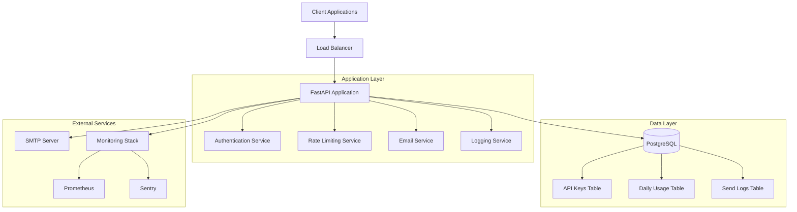
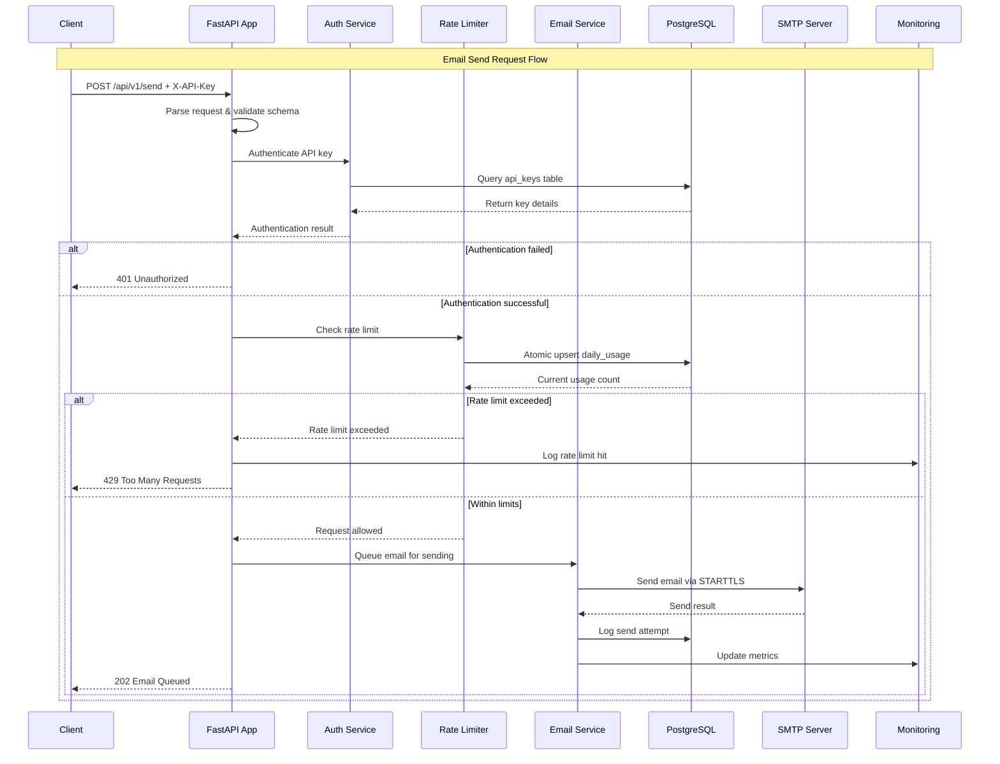
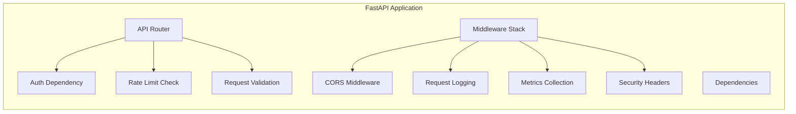
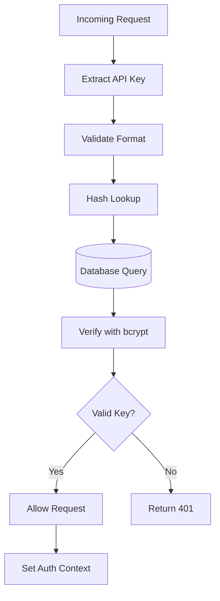
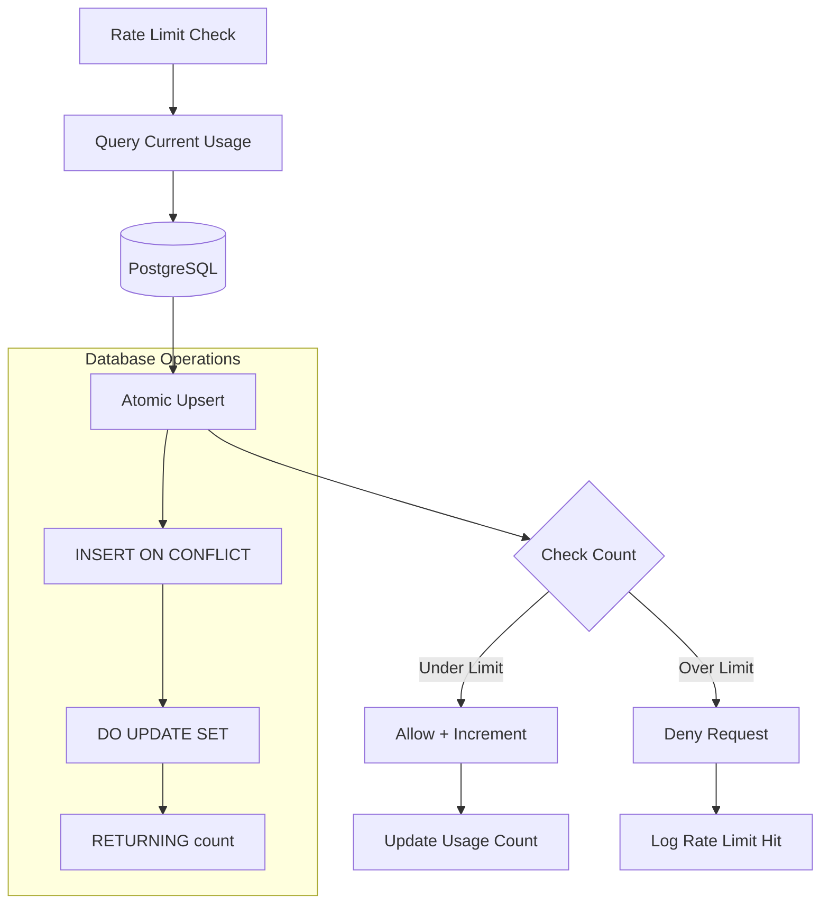
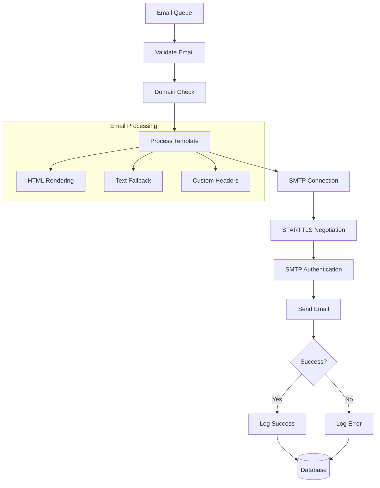
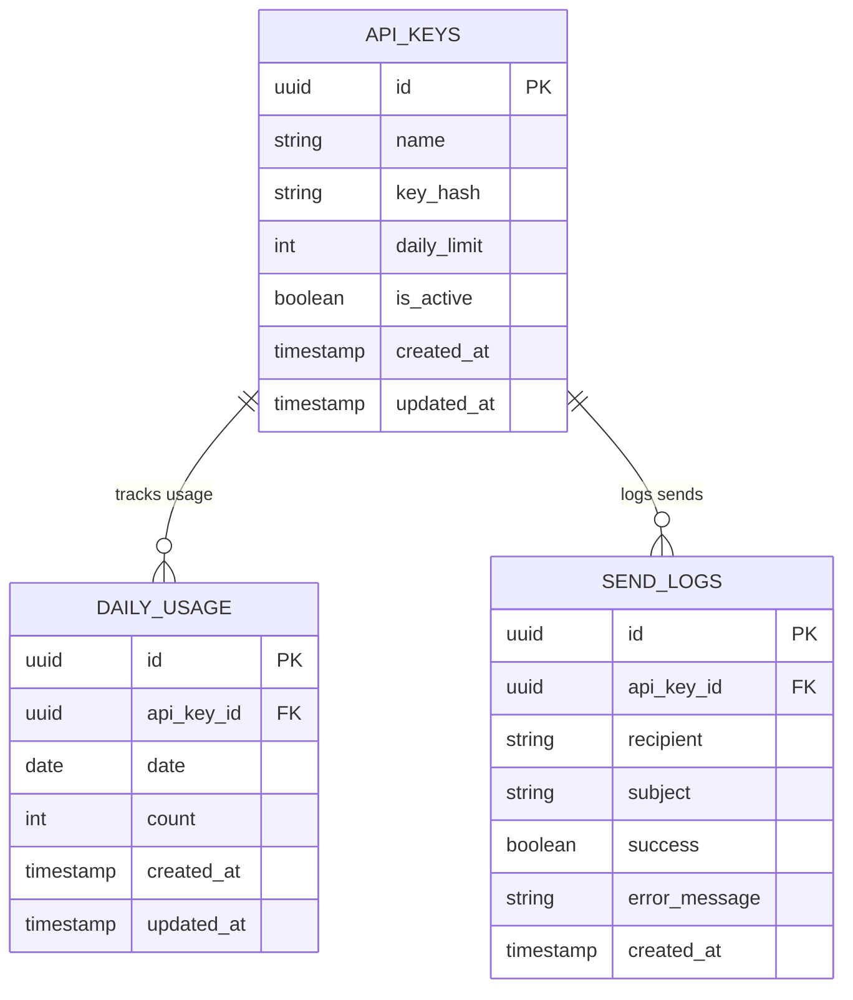
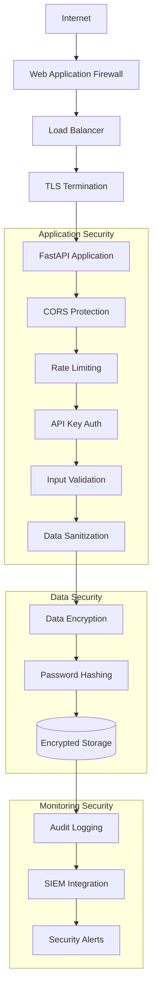
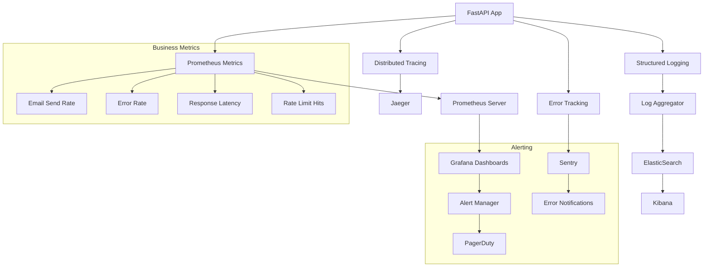
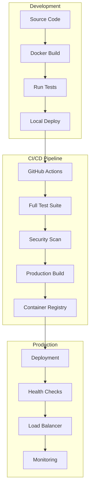

# Architecture Documentation

This document describes the technical architecture and design patterns used in the Teach Me Mailer service.

## Overview

Teach Me Mailer is a production-ready email service built with modern async Python technologies. It provides a secure, scalable, and observable API for sending emails with built-in rate limiting and comprehensive monitoring.

## System Architecture

### High-Level Architecture

### Request Flow Architecture

## Component Architecture

### 1. API Layer

**Key Components:**
- **FastAPI Router**: RESTful endpoint definitions
- **Dependency Injection**: Clean separation of concerns
- **Middleware Stack**: Cross-cutting concerns (CORS, logging, metrics)
- **Pydantic Models**: Request/response validation

### 2. Authentication Service

**Security Features:**
- bcrypt password hashing with configurable rounds
- Constant-time comparison to prevent timing attacks
- API key format validation (sk_test_* or sk_live_*)
- Database-backed key storage with UUIDs

### 3. Rate Limiting Service

**Technical Implementation:**
- PostgreSQL `INSERT ... ON CONFLICT DO UPDATE` for atomicity
- Daily usage tracking with automatic reset
- Thread-safe operations in high-concurrency scenarios
- Configurable rate limits per API key

### 4. Email Service

**Features:**
- Async SMTP client with connection pooling
- STARTTLS encryption for secure delivery
- Domain validation and MX record checking
- HTML and text body support
- Custom header support
- Comprehensive error handling and logging

## Data Model

### Database Schema

### Key Design Decisions

1. **UUIDs for Primary Keys**: Better security and distributed system support
2. **Separate Usage Tracking**: Enables efficient rate limiting queries
3. **Audit Trail**: Complete send log history for debugging and compliance
4. **Timestamp Tracking**: Enables time-based analytics and cleanup

## Security Architecture

### Defense in Depth

**Security Layers:**
1. **Network**: TLS encryption, CORS, request size limits
2. **Authentication**: bcrypt hashing, secure API key format
3. **Authorization**: Per-key rate limiting
4. **Input Validation**: Pydantic schema validation
5. **Data Protection**: Sensitive data masking in logs
6. **Monitoring**: Comprehensive audit trails and alerting

## Observability Architecture

### Monitoring Stack

### Key Metrics

1. **Performance Metrics**:
   - HTTP request duration (p50, p95, p99)
   - Email send latency
   - Database query performance
   - SMTP connection time

2. **Business Metrics**:
   - Total emails sent per day/hour
   - Success/failure rates
   - Rate limit hit rate
   - API key usage patterns

3. **System Metrics**:
   - CPU and memory usage
   - Database connection pool status
   - Active concurrent connections
   - Error rates by endpoint

## Deployment Architecture

### Container Strategy

### Scaling Strategy

**Horizontal Scaling**:
- Stateless application design
- Database connection pooling
- Shared session state via Redis (future)

**Vertical Scaling**:
- Async I/O for high concurrency
- Efficient memory usage
- Database query optimization

## Performance Considerations

### Optimization Strategies

1. **Database Optimization**:
   - Connection pooling with SQLAlchemy
   - Efficient indexing on query patterns
   - Atomic operations for rate limiting
   - Read replicas for analytics queries

2. **Application Optimization**:
   - Async/await for I/O operations
   - Connection pooling for SMTP
   - Response streaming for large payloads
   - Caching frequently accessed data

3. **Infrastructure Optimization**:
   - CDN for static assets
   - Database read replicas
   - Redis caching layer
   - Horizontal pod autoscaling

### Performance Targets

| Metric | Target | Monitoring |
|--------|--------|------------|
| Response Time (p95) | < 100ms | Prometheus |
| Email Send Rate | 1000/min | Business metrics |
| Availability | 99.9% | Health checks |
| Database Queries | < 50ms | Query logging |

## Future Architecture Enhancements

### Planned Improvements

1. **Message Queue Integration**:
   - Redis/RabbitMQ for email queuing
   - Retry logic with exponential backoff
   - Dead letter queue for failed sends

2. **Multi-tenant Architecture**:
   - Tenant isolation
   - Per-tenant rate limiting
   - Tenant-specific SMTP configurations

3. **Advanced Monitoring**:
   - Custom business dashboards
   - Predictive alerting
   - Cost optimization metrics

4. **Enhanced Security**:
   - OAuth 2.0 integration
   - Role-based access control
   - API versioning strategy

This architecture provides a solid foundation for a production email service while maintaining flexibility for future enhancements and scaling requirements.
